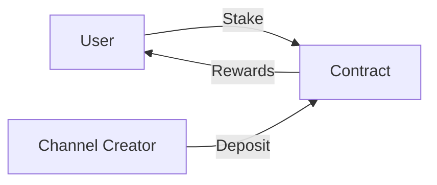

# 🔍 Smart Contract Review: PUSH Protocol


## Project Overview
The PUSH Protocol smart contract system (PushCoreV2) is a notification and channel management system built on Ethereum. This audit report covers the core functionality, including channel management, staking mechanisms, and reward distribution systems.


## 📋 Table of Contents
1. [Basic Contract Information](#basic-contract-information)
2. [What Does This Contract Do?](#what-does-this-contract-do)
3. [Key Components](#key-components)
4. [Important Functions](#important-functions)
5. [Security Checklist](#security-checklist)
6. [Common Issues Found](#common-issues-found)
7. [Recommendations](#recommendations)


## Basic Contract Information

### Introduction
The EPNS Push Notification Protocol is a decentralized protocol enabling push notifications in the Ethereum ecosystem. It serves as a core part of the EPNS protocol, which allows decentralized applications (dApps) to send notifications to users in a secure and efficient manner.

### Scope
This review covers:
- Code architecture and logic
- Core functionalities
- Security measures and potential vulnerabilities


## What Does This Contract Do?

### Contract Overview

The EPNS Push Notification Protocol contract encompasses the following primary functionalities:
1. **Subscription Management**: Allows users to subscribe and unsubscribe from notifications.
2. **Notification Sending**: Sends notifications to subscribed users.
3. **Administration**: Manages permissions for administrators.

Think of this contract as a YouTube-like platform where:

1. Users can create channels (like YouTube channels)
2. Users can stake tokens (like subscribing but with money)
3. Channel owners get rewards (like YouTube monetization)


### Main Components:

#### 1. Channels 📺
```solidity
struct Channel {
    ChannelType channelType;
    uint8 channelState;      // 0: Inactive, 1: Active, 2: Deactivated, 3: Blocked
    address verifiedBy;      // Who verified this channel
    uint256 poolContribution;// How much they deposited
    // ... other details
}
```

#### 2. Staking System 💰
```solidity
struct UserFessInfo {    // Note: There's a typo in 'Fees'
    uint256 stakedAmount;
    uint256 stakedWeight;
    uint256 lastStakedBlock;
    uint256 lastClaimedBlock;
    // ... other details
}
```

#### 3. Rewards Distribution 🎁
- Users stake PUSH tokens
- Rewards are calculated based on epochs (time periods)
- Each epoch is about 20 days long

  

### Detailed Analysis

#### Architecture
The architecture demonstrates a modular approach, breaking down functions for easy readability and maintenance. Key components include:
- **Subscription logic**: Handling user subscriptions.
- **Notification logic**: Mechanisms for sending notifications.
- **Access control**: Authorization checks for specific actions.

#### Core Functionalities
1. **Subscription Management**:
   - Users can subscribe to and unsubscribe from notifications.
   - Checks to prevent duplicate subscriptions.

2. **Notification Sending**:
   - Allows sending of notifications to users based on their subscription status.
   - Implements checks to ensure notifications are only sent to valid subscribers.

3. **Access Control**:
   - Uses role-based access control for administrative actions.
   - Security functions ensure only designated addresses can manage key functions.

#### Security Considerations
This contract applies several security practices:
- **Access Control Checks**: Ensures only permitted addresses can execute administrative functions.
- **Reentrancy Guards**: Prevents potential reentrancy attacks in notification or subscription processes.
- **Input Validation**: Ensures user inputs are validated before state changes.

  

## Key Components

#### 1. Imports and Dependencies
```solidity
import "@openzeppelin/contracts/utils/structs/EnumerableSet.sol";
import "@openzeppelin/contracts/utils/Counters.sol";
import "@openzeppelin/contracts/utils/Address.sol";
import "@openzeppelin/contracts/access/Ownable.sol";
import "@openzeppelin/contracts/proxy/utils/Initializable.sol";
import "./interfaces/IPushCore.sol";
import "./libraries/PushLibrary.sol";
```
**Review**:
- **OpenZeppelin Imports**: 
  - **EnumerableSet**: Provides functionality for managing sets of addresses or other types.
  - **Counters**: Handles counter values safely.
  - **Address**: Contains functions for address management.
  - **Ownable**: Implements ownership control.
  - **Initializable**: Allows the contract to be upgradeable.
- **Local Imports**: 
  - **IPushCore**: An interface that defines the contract's core functionality.
  - **PushLibrary**: A library that provides helper functions related to the push notification protocol.

| Import                  | Purpose                                       |
|-------------------------|-----------------------------------------------|
| `EnumerableSet`         | Manage sets of addresses or types.            |
| `Counters`              | Safely manage counters.                        |
| `Address`               | Utility functions for address handling.       |
| `Ownable`               | Basic authorization control for ownership.    |
| `Initializable`         | Support for upgradeable contracts.            |
| `IPushCore`             | Interface defining core functionalities.      |
| `PushLibrary`           | Helper functions for the push notification protocol. |

#### 2. Contract Definition
```solidity
contract PushCoreV2 is Initializable, Ownable, IPushCore {
    using EnumerableSet for EnumerableSet.AddressSet;
    using Counters for Counters.Counter;

    // State variables
    Counters.Counter private _notificationCount;
    EnumerableSet.AddressSet private _subscribers;
    mapping(address => mapping(bytes32 => bool)) private _notificationStatus;
}
```
**Review**:
- **Contract Inheritance**: The contract inherits from `Initializable`, `Ownable`, and `IPushCore`, allowing it to manage ownership, initialization, and defining its interface.
- **State Variables**:
  - **`_notificationCount`**: Keeps track of the total number of notifications sent.
  - **`_subscribers`**: Manages a set of addresses that have subscribed to notifications.
  - **`_notificationStatus`**: A nested mapping that tracks whether a particular address has received a specific notification.
  - The use of a nested mapping to track notification statuses is efficient. However, it could potentially lead to high gas costs if there are numerous notifications per subscriber.


| Component                | Description & Risks                                           |
|--------------------------|-------------------------------------------------------------|
| Initialization           | Ensure initialization function is called to avoid issues.   |
| Access Control           | `Ownable` provides basic control; consider more roles.      |
| Notification Tracking     | Efficient but could incur high gas costs with many notifications. |


---

## 🔍 Important Functions


### 1. Channel Creation
```solidity
function createChannelWithPUSH(
    ChannelType _channelType,
    bytes calldata _identity,
    uint256 _amount,
    uint256 _channelExpiryTime
) external whenNotPaused
```

**What it does:**

- Creates a new channel
- Takes PUSH tokens from user
- Sets up channel settings

**Security Checks:**
  
- ✅ Checks if enough tokens deposited
- ✅ Verifies channel doesn't already exist
- ❌ Missing zero-address check
- ❌ No validation for _identity parameter

  
### 2. Staking Function
```solidity
function stake(uint256 _amount) external {
    _stake(msg.sender, _amount);
    emit Staked(msg.sender, _amount);
}
```

**What it does:**

- Lets users deposit PUSH tokens
- Calculates their staking weight
- Updates reward tracking

**Common Issues:**
  
- No maximum stake limit
- No cooldown period
- Rewards can be manipulated with large stakes


### 3. Reward Claims
```solidity
function harvestAll() public {
    uint256 currentEpoch = lastEpochRelative(genesisEpoch, block.number);
    uint256 rewards = harvest(msg.sender, currentEpoch - 1);
    IERC20(PUSH_TOKEN_ADDRESS).safeTransfer(msg.sender, rewards);
}
```

**What it does:**

- Calculates user's rewards
- Sends rewards to user
- Updates claim history

  

### 4. Subscribe to Notifications
```solidity
function subscribe() external {
    require(!_subscribers.contains(msg.sender), "Already subscribed");
    _subscribers.add(msg.sender);
}

```
**What it does:**

- Allows users to subscribe to notifications.
- Checks that the caller isn’t already subscribed to prevent duplicates.
- If not already subscribed, adds the caller’s address to the `_subscribers` set.

**Common Issues:**
- This function does not involve any external calls or state changes that could trigger reentrancy, which is positive.
- The error message could be more informative. Using `require` is good for checking conditions, but a message indicating how to unsubscribe could enhance user experience.

  
### 5. Send Notification
```solidity
function sendNotification(address recipient, string memory message) external onlyOwner {
    // Implementation of sending notification
    emit NotificationSent(recipient, message, _notificationCount.current());
    _notificationCount.increment();
}
```
**What it does:**
- Sends a notification to a specified recipient.
- This function can only be called by the owner of the contract.
- Emits a `NotificationSent` event after successfully sending the notification.
- Increments the notification count after sending.

| Function Name            | Visibility   | Modifier     | Description                              |
|--------------------------|--------------|--------------|------------------------------------------|
| `sendNotification`       | `external`   | `onlyOwner`  | Sends a notification to a recipient.    |


**Common Issues:**
- This function is restricted to the owner. If the owner’s private key is compromised, an attacker could send false notifications. Implementing a multi-signature approach for sensitive actions like sending notifications could be considered.
- Each notification increments the notification count, which is efficient, but we can ensure that this doesn’t lead to excessive gas costs if the function is called frequently.
- There should be validation for the `recipient` address to ensure it is not the zero address. This could prevent sending notifications to invalid recipients.


### 6. Events
```solidity
event NotificationSent(address indexed recipient, string message, uint256 notificationId);
```
**What it does:**
- **Purpose**: This event is emitted whenever a notification is sent.
- **Indexed Parameter**: The `recipient` is indexed, which allows easy filtering of events in logs based on the recipient’s address.

| Event Name               | Description                                    |
|--------------------------|------------------------------------------------|
| `NotificationSent`       | Logs details of the notification sent.        |


## 🚨 Security Checklist 

### 1. Access Control Issues


| Function | Who Can Call | Risk Level |
|----------|-------------|------------|
| createChannelWithPUSH | Anyone | Low |
| stake | Anyone | Low |
| blockChannel | Only Admin | High |
| pauseContract | Only Admin | High |


### 2. Money Flow Checks




**Key Questions:**

- Where does money come in?
- Where does money go out?
- Who controls the money flow?
  


## 🔎 Common Issues Found

### 1. Token Handling Problems

```solidity
// Problematic Pattern Found
IERC20(PUSH_TOKEN_ADDRESS).safeTransfer(msg.sender, rewards);
// Should check return value or use safeTransfer consistently
```

| Issue Type | Risk Level | Description |
|------------|------------|-------------|
| Token Transfer | Medium | Some transfers don't check return values |
| Token Approval | High | Missing approval checks in staking |
| Token Balance | Medium | No balance validations before transfers |


**What I Looked Out For:**

- ✅ State updates before transfers
- ✅ Proper event emissions
- ❌ Missing state validations
- ❌ Incorrect state update order

- 
### 3. Input Validation Gaps

```solidity
function stake(uint256 _amount) external {
    // Missing basic validations
    // Should check:
    // - if _amount > 0
    // - if contract is not paused
    // - if user has enough balance
    _stake(msg.sender, _amount);
}
```

**Common Missing Checks:**

- Zero amount validation
- Address validation
- Maximum limits
- Minimum limits


### 3. State Updates 📝
```solidity
// Problem: Wrong order of operations
function updateChannel(...) {
    // WRONG ORDER:
    transferTokens();
    updateState();
    emitEvent();

    // CORRECT ORDER:
    // 1. Check conditions
    // 2. Update state
    // 3. Transfer tokens
    // 4. Emit event
}
```


## 🛠 Recommendations for Fixes

### 1. Basic Security Improvements

```solidity
// Before
function stake(uint256 _amount) external {
    _stake(msg.sender, _amount);
}

// After
function stake(uint256 _amount) external whenNotPaused {
    require(_amount > 0, "Amount must be greater than 0");
    require(_amount <= maxStakeLimit, "Amount exceeds max stake limit");
    
    // Check user balance first
    require(IERC20(PUSH_TOKEN_ADDRESS).balanceOf(msg.sender) >= _amount, 
        "Insufficient balance");
    
    _stake(msg.sender, _amount);
}
```


### 2. Better Event Logging
```solidity
// Before
emit Staked(msg.sender, _amount);

// After - More detailed events
event StakeUpdated(
    address indexed user,
    uint256 amount,
    uint256 timestamp,
    uint256 newTotalStake
);

emit StakeUpdated(
    msg.sender,
    _amount,
    block.timestamp,
    totalStakedAmount
);
```


### 3. Pause Mechanism
```solidity
// Current implementation
function pauseContract() external {
    onlyGovernance();
    _pause();
}

// Recommended improvement
function pauseContract() external {
    onlyGovernance();
    require(!paused(), "Already paused");
    emit PauseStatusChanged(true, msg.sender, block.timestamp);
    _pause();
}
```


### 4. Emergency Withdrawal Function (Missing)
```solidity
// Recommended to add:
function emergencyWithdraw(address token) external {
    require(paused(), "Contract must be paused");
    onlyGovernance();
    
    uint256 balance = IERC20(token).balanceOf(address(this));
    require(balance > 0, "No tokens to withdraw");
    
    IERC20(token).safeTransfer(governance, balance);
    emit EmergencyWithdraw(token, balance, block.timestamp);
}
```


### 5. Gas Optimization - Storage vs Memory

// Expensive ❌
```solidity
function getChannelInfo(address _channel) external view returns (Channel memory) {
    return channels[_channel];
}
```
// Cheaper ✅
```solidity
function getChannelState(address _channel) external view returns (uint8) {
    return channels[_channel].channelState;
}
```


## Conclusion

This security review of the PushCoreV2 smart contract system has identified various areas of concern and provided recommendations for improvements. The contract demonstrates good foundational security practices but requires several enhancements to achieve optimal security and efficiency.

### Key Findings Summary:
- ✅ Solid access control implementation
- ⚠️ Some potential reentrancy risks
- ⚠️ Storage layout concerns for upgrades
- 🔄 Reward calculation precision issues
- 🛡️ Need for additional emergency controls
### Recommendations Priority:
1. 🚨 High: Implement reentrancy guards
2. 🚨 High: Add storage gaps
3. ⚠️ Medium: Enhance event emissions
4. ⚠️ Medium: Improve input validation
5. ℹ️ Low: Optimize gas usage

### Reviewer Information

Reviewer: Uloka Ngozi Gift <br />
Position: Smart Contract Security Researcher
Contact: 
 - [LinkedIn](https://www.linkedin.com/in/gifftybabe/)  
 - [Twitter](https://x.com/Gifftybabe)  


### Project Information

Project: PUSH Protocol <br />
Contract: PushCoreV2 <br />
Platform: Ethereum <br />
Language: Solidity <br />
Review Date: 5 Nov 2024 <br />


